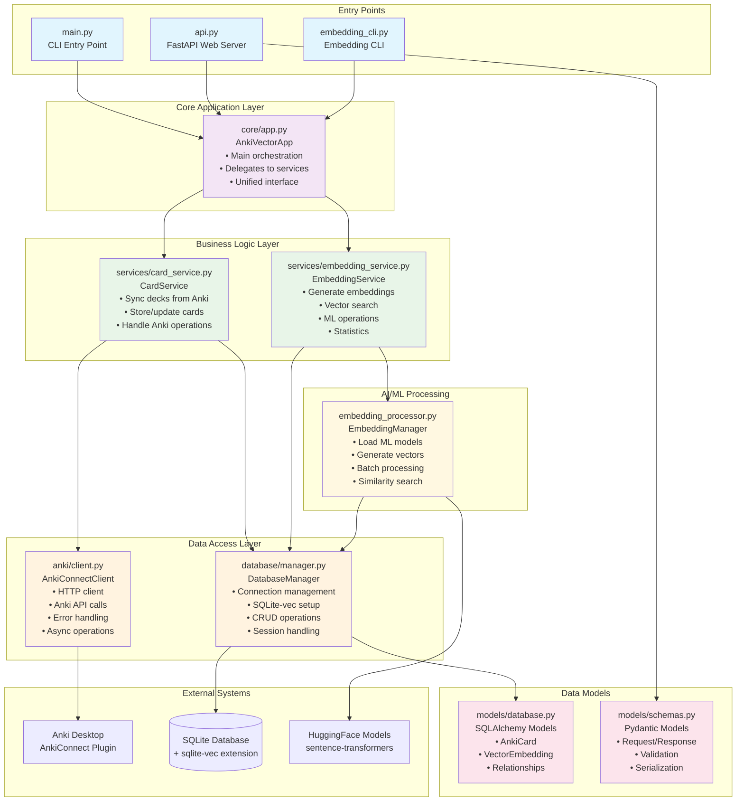

# Architecture Overview

This diagram shows the complete system architecture with all modules and their relationships.

## Key Components

### Entry Points
- **CLI (main.py)**: Command-line interface for basic operations
- **API (api.py)**: FastAPI web server providing REST endpoints
- **Embedding CLI**: Specialized CLI for embedding operations

### Core Application
- **AnkiVectorApp**: Main orchestration class that coordinates all operations
- Provides unified interface for different entry points
- Delegates work to specialized services

### Business Logic Services
- **CardService**: Handles all card-related operations (sync, storage, updates)
- **EmbeddingService**: Manages AI/ML operations (generation, search, statistics)

### Data Access Layer
- **DatabaseManager**: Handles SQLite connections, transactions, and sqlite-vec setup
- **AnkiConnectClient**: HTTP client for communicating with Anki Desktop

### AI/ML Processing
- **EmbeddingManager**: Loads ML models, generates vectors, performs similarity search

### Data Models
- **Database Models**: SQLAlchemy ORM models for data persistence
- **API Schemas**: Pydantic models for API request/response validation

### External Systems
- **Anki Desktop**: Source of card data via AnkiConnect plugin
- **SQLite Database**: Local storage with sqlite-vec extension for vector search
- **HuggingFace Models**: Pre-trained sentence transformers for embeddings 
