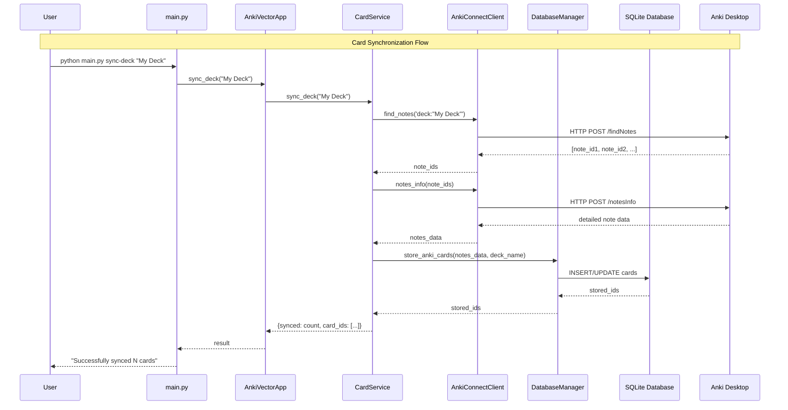

# Card Synchronization Flow

This sequence diagram shows how cards are synchronized from Anki Desktop to the local database.

## Process Overview

### 1. User Initiation
- User runs CLI command to sync a specific deck
- Command is passed to the main application

### 2. Service Delegation
- `AnkiVectorApp` delegates to `CardService`
- Clean separation of concerns - app orchestrates, service implements

### 3. Anki Communication
- `AnkiConnectClient` queries Anki Desktop via HTTP
- First finds note IDs matching the deck query
- Then fetches detailed information for each note

### 4. Data Processing
- Raw note data is processed and normalized
- Cards are stored or updated in SQLite database
- Returns list of affected card IDs

### 5. Result Propagation
- Results bubble back up through the layers
- User receives confirmation of successful sync

## Key Features

- **Async Operations**: Non-blocking I/O throughout the pipeline
- **Error Handling**: Each layer can handle and propagate errors appropriately
- **Idempotent**: Can be run multiple times safely (updates existing cards)
- **Batch Processing**: Efficiently handles multiple cards at once
- **Clean Architecture**: Each component has a single responsibility

## AnkiConnect API Calls

The system uses these AnkiConnect API endpoints:
- `findNotes`: Search for notes matching a query
- `notesInfo`: Get detailed information for specific notes
- Both use HTTP POST with JSON payloads

## Database Operations

- Cards are stored in the `anki_cards` table
- Existing cards are updated if they already exist (based on `anki_note_id`)
- New cards are inserted with generated IDs
- Relationships to embeddings are maintained via foreign keys 
