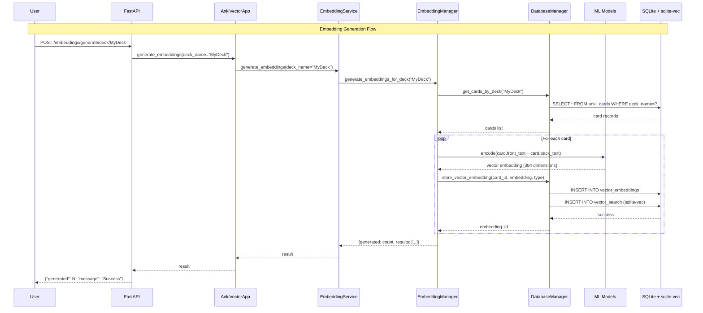

# Embedding Generation Flow

This sequence diagram shows how AI embeddings are generated for cards using machine learning models.

## Process Overview

### 1. API Request
- User makes HTTP POST request to generate embeddings for a deck
- Request includes deck name and optional parameters

### 2. Service Orchestration
- `AnkiVectorApp` delegates to `EmbeddingService`
- `EmbeddingService` coordinates with `EmbeddingManager`

### 3. Data Retrieval
- System fetches all cards from the specified deck
- Cards are loaded from the database with their text content

### 4. ML Processing
- For each card, text content is processed by ML models
- Sentence transformers generate 384-dimensional vector embeddings
- Different embedding types can be generated (front, back, combined)

### 5. Dual Storage
- Embeddings are stored in two places:
  - `vector_embeddings` table (SQLAlchemy managed)
  - `vector_search` table (sqlite-vec optimized)

### 6. Result Reporting
- System tracks successful and failed generations
- Results are propagated back through the layers
- User receives summary of operation

## Key Features

### Machine Learning
- **Model**: sentence-transformers/all-MiniLM-L6-v2
- **Dimensions**: 384-dimensional vectors
- **Local Processing**: Models run locally, no external API calls
- **Caching**: Models are cached after first load

### Embedding Types
- **Front**: Only front text of card
- **Back**: Only back text of card  
- **Combined**: Front + back text concatenated

### Storage Strategy
- **Dual Storage**: Both normalized tables and optimized vector storage
- **Fast Search**: sqlite-vec enables millisecond similarity searches
- **Consistency**: Transactions ensure data integrity

### Performance Optimizations
- **Batch Processing**: Multiple cards processed efficiently
- **Async Operations**: Non-blocking I/O throughout
- **Progress Tracking**: Long operations provide feedback
- **Error Isolation**: Individual card failures don't stop batch

## Configuration

Key settings that affect embedding generation:
- `embedding_model`: Which transformer model to use
- `embedding_batch_size`: How many cards to process at once
- `embedding_dimension`: Expected vector dimensions
- `embedding_device`: CPU or GPU processing 
