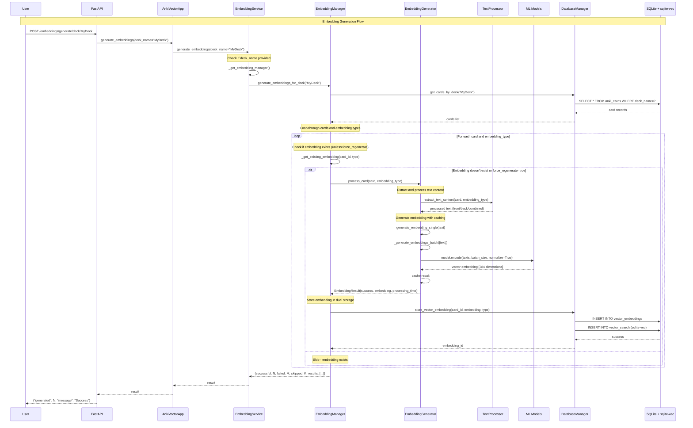

# Embedding Generation Flow

This sequence diagram shows how AI embeddings are generated for cards using machine learning models.



## Process Overview

### 1. API Request
- User makes HTTP POST request to generate embeddings for a deck
- Request includes deck name and optional `force_regenerate` parameter

### 2. Service Orchestration
- `AnkiVectorApp` delegates to `EmbeddingService`
- `EmbeddingService` lazy-loads `EmbeddingManager` on first use
- **Deck Path**: When `deck_name` provided, calls `generate_embeddings_for_deck()`
- **Individual Path**: When `card_ids` provided, uses different processing logic

### 3. Data Retrieval
- `EmbeddingManager` fetches all cards from the specified deck
- Cards are loaded from database with their text content

### 4. Text Processing & ML Pipeline
- **Text Extraction**: `TextProcessor.extract_text_content()` processes card content:
  - **Front**: Only front text of card
  - **Back**: Only back text of card  
  - **Combined**: Front + back text concatenated
  - HTML cleaning and normalization
- **Caching**: Text hash-based caching prevents duplicate processing
- **ML Processing**: `EmbeddingGenerator` handles the AI pipeline:
  - Loads sentence transformer model in thread pool
  - Processes text through `model.encode()` with batching
  - Returns 384-dimensional vector embeddings

### 5. Dual Storage Strategy
- **Primary Storage**: `vector_embeddings` table (SQLAlchemy managed)
- **Optimized Storage**: `vector_search` table (sqlite-vec for fast similarity search)
- **Transaction Safety**: Each embedding stored atomically

### 6. Result Aggregation
- System tracks successful, failed, and skipped generations
- Progress tracking with detailed timing information
- Results propagated back through all layers
- User receives comprehensive operation summary

## Key Architecture Corrections

### Missing Components in Previous Diagram
1. **EmbeddingGenerator Layer**: Handles actual ML model interaction
2. **TextProcessor**: Extracts and cleans text content by type
3. **Caching Layer**: Prevents duplicate embedding generation
4. **Existence Checking**: Skips already-processed embeddings
5. **Error Handling**: Individual card failures don't stop batch processing

### Dual Processing Paths
The `EmbeddingService` has two distinct paths:
- **Deck-based**: Uses `EmbeddingManager.generate_embeddings_for_deck()`
- **Card-based**: Direct processing when specific `card_ids` provided

### Actual ML Model Flow
```
EmbeddingManager → EmbeddingGenerator → TextProcessor → ML Model
```
Not the simplified: `EmbeddingManager → ML Model`

## Key Features

### Machine Learning Pipeline
- **Model**: sentence-transformers/all-MiniLM-L6-v2
- **Dimensions**: 384-dimensional vectors
- **Processing**: Thread pool executor for non-blocking operations
- **Batching**: Configurable batch sizes for efficiency
- **Device Support**: Auto-detection (CUDA, MPS, CPU)

### Text Processing
- **HTML Cleaning**: Removes Anki formatting and HTML tags
- **Content Extraction**: Flexible extraction based on embedding type
- **Normalization**: Consistent text preprocessing
- **Empty Handling**: Zero vectors for empty content

### Performance Optimizations
- **Lazy Loading**: Models loaded only when needed
- **Caching**: Hash-based embedding cache
- **Batch Processing**: Multiple cards processed efficiently
- **Async Operations**: Non-blocking I/O throughout
- **Progress Tracking**: Real-time feedback for long operations
- **Error Isolation**: Individual card failures don't stop batch

### Storage Strategy
- **Consistency**: Transactions ensure data integrity
- **Dual Storage**: Both normalized and optimized storage
- **Fast Search**: sqlite-vec enables millisecond similarity searches
- **Scalability**: Handles large card collections efficiently

## Configuration

Key settings that affect embedding generation:
- `embedding_model`: Which transformer model to use
- `embedding_batch_size`: How many cards to process at once
- `embedding_dimension`: Expected vector dimensions (384 for all-MiniLM-L6-v2)
- `embedding_device`: CPU, CUDA, or MPS processing
- `embedding_types`: Which embedding types to generate ["front", "back", "combined"] 
