# Layered Architecture

This diagram shows the clean architecture with clear separation of concerns across different layers.

```mermaid
graph TB
    subgraph "🌐 Presentation Layer"
        direction TB
        CLI_LAYER["CLI Interface<br/>main.py"]
        API_LAYER["REST API<br/>api.py"]
        EMBED_CLI_LAYER["Embedding CLI<br/>embedding_cli.py"]
    end
    
    subgraph "🎯 Application Layer"
        direction TB
        APP_LAYER["Application Orchestration<br/>core/app.py<br/>• Coordinates services<br/>• Business workflows<br/>• Entry point for operations"]
    end
    
    subgraph "⚙️ Service Layer"
        direction TB
        CARD_SERVICE["Card Management<br/>services/card_service.py<br/>• Sync from Anki<br/>• Card operations"]
        
        EMBED_SERVICE["Embedding Management<br/>services/embedding_service.py<br/>• Generate embeddings<br/>• Vector search<br/>• ML operations"]
    end
    
    subgraph "🔌 Infrastructure Layer"
        direction TB
        DB_INFRA["Database Access<br/>database/manager.py<br/>• Connection pooling<br/>• Transaction management<br/>• SQLite-vec setup"]
        
        ANKI_INFRA["External API<br/>anki/client.py<br/>• HTTP client<br/>• API communication<br/>• Error handling"]
        
        ML_INFRA["ML Processing<br/>embedding_processor.py<br/>• Model loading<br/>• Vector computation<br/>• Batch processing"]
    end
    
    subgraph "📊 Data Layer"
        direction TB
        MODELS["Data Models<br/>models/<br/>• Database schemas<br/>• API contracts<br/>• Validation rules"]
        
        CONFIG["Configuration<br/>config.py<br/>• Settings<br/>• Environment variables"]
    end
    
    subgraph "💾 Storage Layer"
        direction TB
        DATABASE[("SQLite Database<br/>• anki_cards table<br/>• vector_embeddings table<br/>• vector_search")]
        
        ML_MODELS[("ML Models<br/>• HuggingFace transformers<br/>• Local model cache")]
        
        ANKI_EXTERNAL[("Anki Desktop<br/>• AnkiConnect plugin<br/>• Card data source")]
    end
    
    CLI_LAYER --> APP_LAYER
    API_LAYER --> APP_LAYER
    EMBED_CLI_LAYER --> APP_LAYER
    
    APP_LAYER --> CARD_SERVICE
    APP_LAYER --> EMBED_SERVICE
    
    CARD_SERVICE --> DB_INFRA
    CARD_SERVICE --> ANKI_INFRA
    EMBED_SERVICE --> DB_INFRA
    EMBED_SERVICE --> ML_INFRA
    
    DB_INFRA --> MODELS
    DB_INFRA --> CONFIG
    ANKI_INFRA --> CONFIG
    ML_INFRA --> CONFIG
    
    DB_INFRA --> DATABASE
    ANKI_INFRA --> ANKI_EXTERNAL
    ML_INFRA --> ML_MODELS
    
    style CLI_LAYER fill:#e3f2fd
    style API_LAYER fill:#e3f2fd
    style EMBED_CLI_LAYER fill:#e3f2fd
    style APP_LAYER fill:#f3e5f5
    style CARD_SERVICE fill:#e8f5e8
    style EMBED_SERVICE fill:#e8f5e8
    style DB_INFRA fill:#fff3e0
    style ANKI_INFRA fill:#fff3e0
    style ML_INFRA fill:#fff3e0
    style MODELS fill:#fce4ec
    style CONFIG fill:#fce4ec
```



## Architectural Principles

### Clean Architecture
This design follows Clean Architecture principles:
- **Dependency Inversion**: High-level modules don't depend on low-level modules
- **Single Responsibility**: Each layer has one clear purpose
- **Open/Closed**: Open for extension, closed for modification
- **Interface Segregation**: Interfaces are focused and specific

### Layer Responsibilities

#### 🌐 Presentation Layer
**Purpose**: Handle user interface and input/output
- **CLI Interface**: Command-line tools for developers and power users
- **REST API**: HTTP endpoints for web applications and integrations
- **Embedding CLI**: Specialized tools for ML operations

**Key Characteristics**:
- Translates user input into application commands
- Formats output for different interfaces
- Handles authentication and validation
- No business logic

#### 🎯 Application Layer
**Purpose**: Orchestrate business workflows
- **AnkiVectorApp**: Main coordinator that manages the entire application
- Defines use cases and business workflows
- Coordinates between services
- Provides unified interface

**Key Characteristics**:
- Stateless operations
- Delegates to services
- Handles cross-cutting concerns
- Business workflow orchestration

#### ⚙️ Service Layer
**Purpose**: Implement business logic
- **Card Service**: All card-related operations (sync, CRUD, validation)
- **Embedding Service**: AI/ML operations (generation, search, analysis)

**Key Characteristics**:
- Domain-specific logic
- Reusable across interfaces
- Testable in isolation
- Clear boundaries

#### 🔌 Infrastructure Layer
**Purpose**: Handle external systems and technical concerns
- **Database Manager**: Data persistence and connection management
- **Anki Client**: External API communication
- **ML Infrastructure**: Machine learning model management

**Key Characteristics**:
- External system integration
- Technical implementation details
- Error handling and resilience
- Performance optimization

#### 📊 Data Layer
**Purpose**: Define data structures and contracts
- **Models**: Database schemas and API contracts
- **Configuration**: Application settings and environment variables

**Key Characteristics**:
- Pure data definitions
- No business logic
- Validation rules
- Serialization/deserialization

#### 💾 Storage Layer
**Purpose**: Actual data persistence
- **Database**: SQLite with sqlite-vec extension
- **ML Models**: HuggingFace transformers
- **External Systems**: Anki Desktop

**Key Characteristics**:
- Data persistence
- External dependencies
- System resources
- Infrastructure services

## Benefits of This Architecture

### 1. **Testability**
- Each layer can be tested independently
- Mock dependencies easily injected
- Clear boundaries for unit testing

### 2. **Maintainability**
- Changes in one layer don't affect others
- Clear separation of concerns
- Easy to locate and fix issues

### 3. **Scalability**
- Services can be scaled independently
- Easy to add new interfaces
- Performance optimization at appropriate layers

### 4. **Flexibility**
- Easy to swap implementations
- Support multiple interfaces
- Extensible for new features

### 5. **Reusability**
- Services work across different interfaces
- Common infrastructure shared
- Consistent behavior

## Dependency Flow

```
Presentation → Application → Service → Infrastructure → Data/Storage
```

- **Inward Dependencies**: Each layer only depends on layers below it
- **No Circular Dependencies**: Clean, acyclic dependency graph
- **Interface Contracts**: Layers communicate through well-defined interfaces
- **Dependency Injection**: Dependencies are injected, not created

This architecture ensures the system is robust, maintainable, and ready for future enhancements! 
