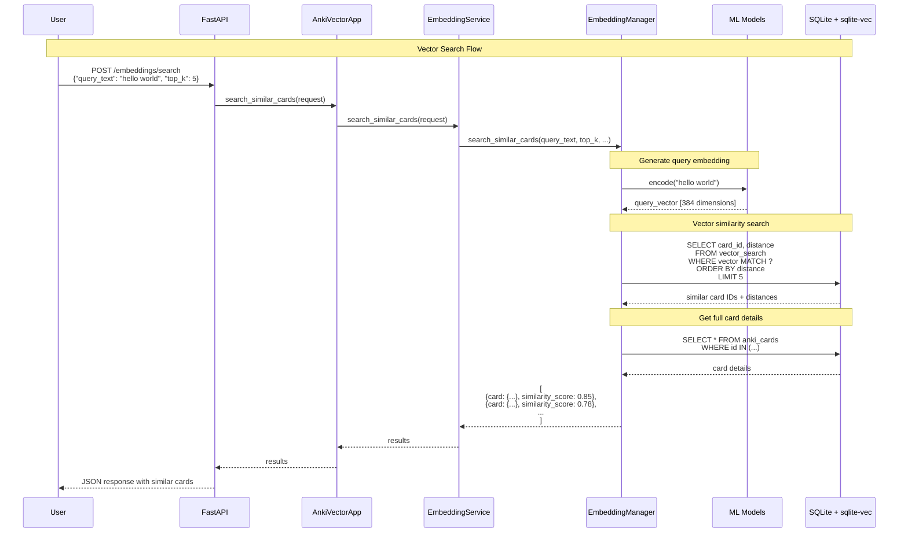

# Vector Search Flow

This sequence diagram shows how the system performs vector similarity search to find related cards.

## Process Overview

### 1. Search Request
- User submits search query via REST API
- Request includes query text and optional parameters (top_k, deck filter, etc.)

### 2. Query Processing
- `EmbeddingService` coordinates the search operation
- `EmbeddingManager` handles the technical details

### 3. Query Embedding
- User's query text is processed by the same ML model used for cards
- Generates 384-dimensional vector representing the semantic meaning
- Same model ensures consistency between queries and stored embeddings

### 4. Vector Similarity Search
- sqlite-vec extension performs fast similarity search
- Uses cosine similarity or dot product to find closest vectors
- Returns card IDs and similarity scores (distances)

### 5. Result Enhancement
- System fetches full card details from the main database
- Combines vector similarity scores with card content
- Formats results for API response

### 6. Response Delivery
- Results are ranked by similarity score
- Include card content, metadata, and similarity scores
- Returned as JSON to the user

## Key Features

### Search Performance
- **Fast Queries**: sqlite-vec enables millisecond searches
- **Scalable**: Performance doesn't degrade significantly with more cards
- **Approximate**: Uses efficient approximate nearest neighbor algorithms

### Search Types
- **Semantic Search**: Finds cards with similar meaning, not just keywords
- **Cross-lingual**: Can find related content across different languages
- **Contextual**: Understands context and relationships between concepts

### Query Options
- **top_k**: Number of results to return (default: 10)
- **deck_name**: Filter results to specific deck
- **embedding_type**: Search against specific embedding type
- **similarity_threshold**: Minimum similarity score to include

### Result Format
Each result includes:
- **card**: Full card object with all fields
- **similarity_score**: Numerical similarity (0.0 to 1.0)
- **distance**: Distance metric (lower = more similar)
- **metadata**: Additional context about the match

## Similarity Metrics

The system uses several similarity metrics:
- **Cosine Similarity**: Measures angle between vectors (most common)
- **Dot Product**: Direct multiplication of vector components
- **Euclidean Distance**: Geometric distance in vector space

## Use Cases

### Study Optimization
- Find cards similar to ones you're struggling with
- Identify redundant or overly similar cards
- Discover related concepts to study together

### Content Discovery
- Find all cards related to a topic
- Explore connections between different subjects
- Identify gaps in your knowledge

### Deck Management
- Merge similar cards from different decks
- Organize cards by semantic similarity
- Find cards that might belong in different decks 
